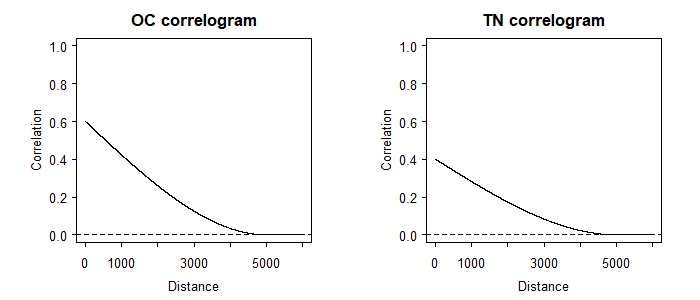
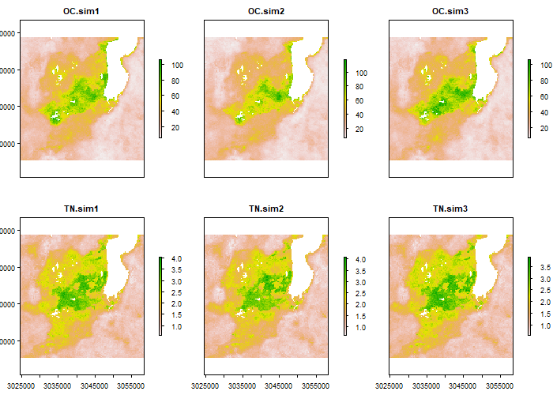
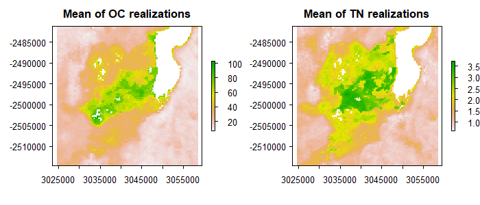

# Case study with cross-correlated variables


### Introduction/Problem definition

In many geographical studies variables are cross-correlated, i.e. in case of positive correlation high and low trend occur simultaneously. As a result uncertainty in one variable may be statistically dependent on uncertainty in the other. For example, the spatial properties of soil, such as organic carbon (OC) and nitrogen (N) content are cross-correlated. These variables are used to derive C/N ratio, vital information to evaluate soil management and to increase the crop productivity, but maps of OC and N are approximations encumbered with errors. These errors will propagate through the calculation into the C/N prediction. 

We can use the Monte Carlo (MC) method to analyse how the error propagates through spatial operations and models (briefly described in the next section). The MC method is fairly straightforward in application, but in case of spatially distributed cross-correlated variables like OC and N one should consider taking spatial cross-correlation into account. That is because the model output (e.g. C/N) may be influenced by the spatial cross-correlation in the input.  

<br>

### Monte Carlo methodology for spatial uncertainty analysis with spatially cross-correlated variables

The adapted uncertainty propagation analysis approach is based on the Monte Carlo method that computes the output of the model repeatedly, with input values that are randomly sampled from their joint probability distribution function (pdf). The set of model outputs forms a random sample from the output pdf, so that the parameters of the distribution, such as the mean, variance and quantiles, can be estimated from the sample. The method thus consists of the following steps:

1.	Characterise uncertain model inputs with a joint pdf.
1.	Repeatedly sample from the joint pdf of uncertain inputs.
1.	Run model with sampled inputs and store model outputs.
1. 	Compute summary statistics of model outputs.

Note that the above ignores uncertainty in model parameters and model structure, but these can easily be included if available as pdfs. A random sample from the model inputs can be obtained using an appropriate pseudo-random number generator. 

For each uncertain spatially distributed continuous variable, such as soil organic carbon content, rainfall or elevation we assume the following geostatistical model:

	Z(x)= µ(x)+ s(x)·e(x)

where x is geographic location,  µ is the (deterministic) mean of Z, s is its standard deviation and e is is standard normal, second-order stationary stochastic residual, whose spatial autocorrelation is modelled with a semivariogram or correlogram. Note that e has zero mean and unit variance. Both µ and s may vary in space so that spatial trends and spatially variable uncertainty can be taken into account. The cross-correlations are modelled using a linear model of co-regionalization (Wackernagel, 2003). The random sample is drawn from the pdf of e to further calculate a sample from Z.

<br>

### C/N uncertainty propagation analysis with 'spup'

<br>

#### Preliminaries - load and view the data

The example data for C/N calculations are a 250m resolution mean OC and TN (total N) of a 33km x 33km area adjacent to lake Alaotra in Madagascar.

The 'Madagascar' dataset contains four spatial objects: a mean OC and TN of the area and their standard deviations. It also has a saved function that calculates C/N using OC and TN that will be used later.


```r
# load packages
library(spup)
library(raster)
library(purrr)

# set seed
set.seed(12345)

# load and view the data
data(OC, OC_sd, TN, TN_sd)
par(mfrow = c(1,2))
class(OC)
```

```
[1] "RasterLayer"
attr(,"package")
[1] "raster"
```

```r
class(TN)
```

```
[1] "RasterLayer"
attr(,"package")
[1] "raster"
```

```r
plot(OC, main = "Mean of Organic Carbon") 
plot(TN, main = "Mean of Total Nitrogen")
```


```r
summary(OC)
```

```
        OC_Madagaskar_xd1_250m
Min.                   7.00000
1st Qu.               14.33333
Median                23.00000
3rd Qu.               39.66667
Max.                 103.00000
NA's                1545.00000
```

```r
summary(TN)
```

```
        TN_Madagaskar_xd1_250m
Min.                     0.609
1st Qu.                  1.000
Median                   1.320
3rd Qu.                  2.080
Max.                     3.740
NA's                  1545.000
```


<br>

#### Define uncertainty model (UM) for the cross-correlated OC and TN

The first step in uncertainty propagation analysis is to define an uncertainty model for the uncertain input variables, here OC and TN, that will be used in the Monte Carlo uncertainty propagation analysis. 

First, the marginal uncertainty model is defined for each variable separately, and next the joint uncertainty model is defined for the variables together.

In case of OC and TN, the e are spatially correlated and in order to include this in the analysis, we need to describe it by spatial correlograms. For each of the variables, the `makecrm()` function collates all necessary information into a list.

Let us assume that the spatial autocorrelation of the OC and TN errors is an are described by spherical correlation function with a short-distance correlation of 0.6 for OC and 0.4 for TN, and a range parameter of 1000m. It is important at this step to ensure that the correlation function types as well as the ranges are the same for each variable. It is a requirement for further analysis, becasue _spup_ employs the model of co-regionalization (Wackernagel,  H.  2003).

<br>


```r
# define spatial correlogram models
OC_crm <- makecrm(acf0 = 0.6, range = 5000, model = "Sph")
TN_crm <- makecrm(acf0 = 0.4, range = 5000, model = "Sph")
```

We can view the correlograms by plotting them.


```r
plot(OC_crm, main = "OC correlogram")
plot(TN_crm, main = "TN correlogram")
```



Spatial correlograms summarise patterns of spatial autocorrelation in data and model residuals. They show the degree of correlation between values at two locations as a function of the separation distance between the locations. In the case above the correlation declines with distance, as is usually the case. The correlation is zero for distances greater than 1000m. More about correlograms is included in the DEM vignette.

In order to complete the description of each individual uncertain variable we use the `defineUM()` function that collates all information about the OC and TN uncertainty. The minimum information required is:

* a logical value that indicates if the variablet is uncertain,
* the type of the probability distribution. In case of variables with spatially correlated errors only the normal distribution is supported. For details on supported distributions and required parameters see `?defineUM`,
* the list of distribution parameters, for example a mean and a standard deviation for the normal distribution. In the case presented here, these are maps of the means and standard deviations of the OC or TN, 
* correlogram model,
* the variable id.


```r
# define uncertainty model for the OC and TN
OC_UM <- defineUM(TRUE, distribution = "norm", distr_param = c(OC, OC_sd), crm = OC_crm, id = "OC")
TN_UM <- defineUM(TRUE, distribution = "norm", distr_param = c(TN, TN_sd), crm = TN_crm, id = "TN")
class(OC_UM)
```

```
[1] "MarginalNumericSpatial"
```

```r
class(TN_UM)
```

```
[1] "MarginalNumericSpatial"
```

Both variables are of the same class "MarginalNumericSpatial". This is one of the requirements for defining a multivariate uncertainty model next. We use the `defineMUM()` function to collate information about uncertainty in each variable as above, and information about their cross-correlation. The required function arguments are:

* a list of defined uncertainty models (by `defineUM()`) for the selected variables,
* a correlation matrix.

The correlation matrix must satisfy a range of conditions:
- square,
- symmetrical (transposed must be the same as original),
- diagonal must all be 1,
- all values must belong to [-1, +1] range,
- it has to be positive-definite (all eigenvalues must be > 0).


```r
# define multivariate uncertainty model
mySpatialMUM <- defineMUM(UMlist = list(OC_UM, TN_UM), 
                          cormatrix = matrix(c(1,0.7,0.7,1), nrow=2, ncol=2))
class(mySpatialMUM)
```

```
[1] "JointNumericSpatial"
```

<br>

#### Generate possible realities of OC and TN

Generating possible realities of the selected variables can be completed by using the `genSample()` function. The required information to pass to the function includes:

* defined uncertain object (as above).
* number of realizations per variable to return.
* sampling method. In case of spatially correlated variables, the method "ugs" (method based on unconditional Gaussian simulation) is recommended, otherwise spatial correlation will not be taken into account. Other sampling methods include "randomSampling" and "lhs" (Latin Hypercube Sampling), where cross-correlations can be accounted for but spatial auto- and cross- correlations are neglected. See `?genSample()` for more details.


Additional parameters may be also specified. For example, sampling of spatially correlated variable is based on the 'gstat' package that allows for limiting the number of nearest observations that should be used for simulation.


```r
# create possible realizations from the joint distribution of OC and TN
OCTN_sample <- genSample(UMobject = mySpatialMUM, n = 3, samplemethod = "ugs", nmax = 20, asList = FALSE)
```

```
Linear Model of Coregionalization found. Good.
[using unconditional Gaussian cosimulation]
```

Note the argument 'asList' has been set to FALSE. This indicates that the sampling function will return an object of a class of the distribution parameters class. This is useful if you want to visualize the sample or compute summary statistics quickly.


```r
# view the sample structure
OCTN_sample
```

```
class       : RasterStack 
dimensions  : 134, 135, 18090, 6  (nrow, ncol, ncell, nlayers)
resolution  : 250, 250  (x, y)
extent      : 3024625, 3058375, -2514625, -2481125  (xmin, xmax, ymin, ymax)
coord. ref. : +proj=laea +lat_0=5 +lon_0=20 +x_0=0 +y_0=0 +datum=WGS84 +units=m +no_defs +ellps=WGS84 +towgs84=0,0,0 
names       :    OC.sim1,    OC.sim2,    OC.sim3,    TN.sim1,    TN.sim2,    TN.sim3 
min values  :  5.6096183,  6.3065236,  6.0443148,  0.5521439,  0.6014500,  0.5442084 
max values  : 106.111421, 117.699482, 106.815170,   4.047288,   4.095120,   3.908364 
```

```r
# plot realizations of OC and TN
plot(OCTN_sample)
```



Usually the sample must be large to obtain stable results. Let us run the sampling to obtain 100 realizations. This may take a minute.


```r
# create possible realizations from the joint 
# distribution of OC and TN
MC <- 500
OCTN_sample <- genSample(UMobject = mySpatialMUM, n = MC,
                         samplemethod = "ugs", nmax = 20, asList = FALSE)
```

```
Linear Model of Coregionalization found. Good.
[using unconditional Gaussian cosimulation]
```

We can view the means and standard deviations of the sampled OC and TN. If the number of samples was very large then the mean of the sample of each would equal the mean  OC and TN, and the sd would equal their sds.


```r
# compute and plot OC and TN sample statistics
# e.g. mean and standard deviation
OC_sample <- OCTN_sample[[1:MC]]
TN_sample <- OCTN_sample[[(MC+1):(2*MC)]]
OC_sample_mean <- mean(OC_sample)
TN_sample_mean <- mean(TN_sample)
OC_sample_sd <- calc(OC_sample, fun = sd)  
TN_sample_sd <- calc(TN_sample, fun = sd)

par(mfrow= c(1,2))
plot(OC_sample_mean, main = "Mean of OC realizations")
plot(TN_sample_mean, main = "Mean of TN realizations")
```



We can also view the cross-corelations between two variables.


